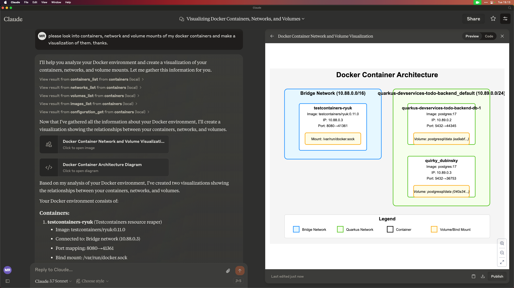

# Model Context Protocol Server for Podman, OCI and Docker Containers

This Model Context Protocol(MCP) server enables Large Language Models (LLMs) to interact with your Podman/OCI/Docker containers.

The server is implemented using Quarkus MCP and the Docker JavaClient.

Connects to your default configured docker socket and thus should work with any OCI/Container compatible engine, such as Docker, Podman, etc.



## General Usage 

1. Install [jbang](https://www.jbang.dev/download/)
2. Configure your MCP Client to run the server (see [Claude Desktop Config](#claude-desktop-config) below)

Below are examples of command lines to use for configuring the server.


```shell
jbang containers@quarkiverse/quarkus-mcp-servers
```

Now ask away about your containers.

### How was this made?

The MCP server uses Quarkus, the Supersonic Subatomic Java Framework and its Model Context Protocol support.

If you want to learn more about Quarkus MCP Server support, please see this [blog post](https://quarkus.io/blog/mcp-server/) 
and the Quarkus MCP Server [extension documentation](https://docs.quarkiverse.io/quarkus-mcp-server/dev/).

To launch the server and handle the magic setup of JDBC urls it uses [jbang](https://jbang.dev/) to
setup Java and run the .jar as transparent as possible. Very similar to how `uvx`, `pipx`, `npmx` and others works; just for Java. 


