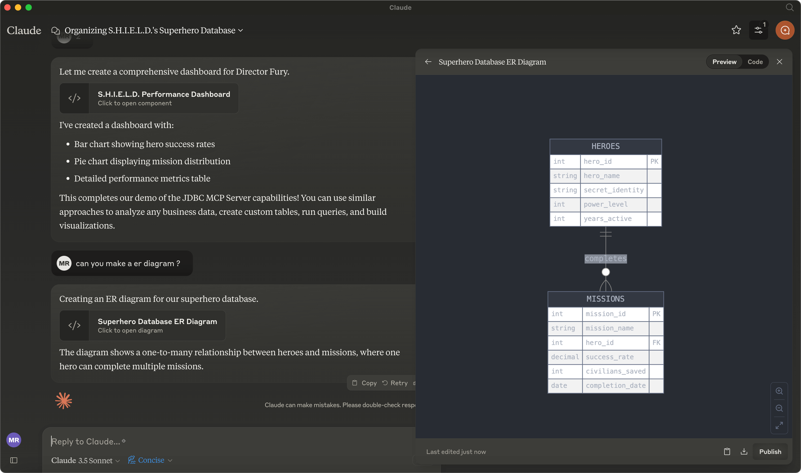

# Model Context Protocol Server for github

This Model Context Protocol(MCP) server enables Large Language Models (LLMs) to work with github.




## General Usage 

1. Install [jbang](https://www.jbang.dev/download/)
2. Configure your MCP Client to run the server (see [Claude Desktop Config](#claude-desktop-config) below)

Below are examples of command lines to use for configuring the server.

Start server:

```shell
jbang github@quarkiverse/quarkus-mcp-servers
```

## Example interaction

"login with token: <secret token>"

"list issues for maxandersen/metatest"

"add comment to last issue with body: 'This is a test comment'"


## Components

Below are the MCP components provided by this server.
he app.

### Tools 


* **add_issue_comment**(body:str, issue_number:int, owner:str, repo:str)
     Add a comment to an existing issue

* **list_issues**(owner:str, repo:str, [perPage:int])
     List issues in a GitHub repository with filtering options

* **login**(token:str)
     Login to GitHub. Provide your personal access token. If url is provided, please ask user to go
     to that url and click on the link to authorize t


## Claude Desktop Config and [mcp-cli](https://github.com/chrishayuk/mcp-cli)

Add this to your `claude_desktop.json` or `server_config.json` file:

```json
{
  "mcpServers": {
    "jdbc": {
      "command": "jbang",
      "args": [
        "mcp-server-github@quarkiverse/quarkus-mcp-server"
      ]
    }
  }
}
```
